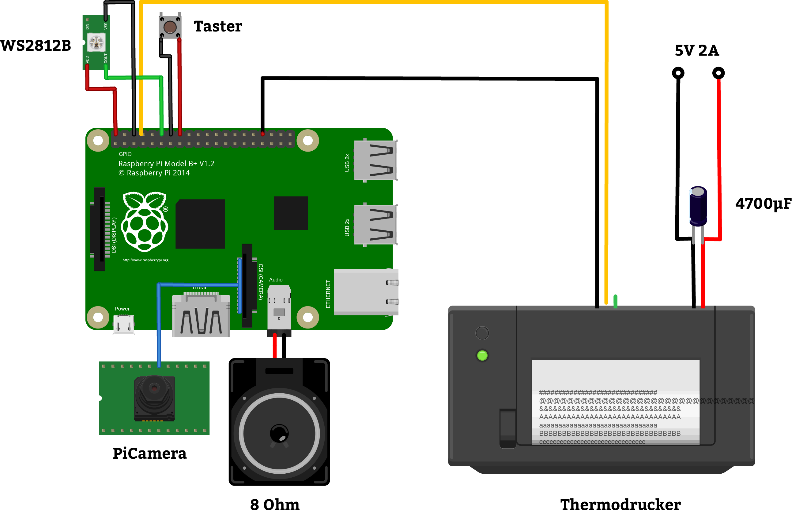

# &nbsp;&nbsp;&nbsp;&nbsp;&nbsp;&nbsp;&nbsp;&nbsp;&nbsp;&nbsp;&nbsp;&nbsp;&nbsp;&nbsp;&nbsp;&nbsp;&nbsp;&nbsp;&nbsp;&nbsp;&nbsp;&nbsp;&nbsp;&nbsp;
*Ein Bachelorprojekt von André Fritzinger und Jeannine Krämer im WS18/19.*
*Betreut durch Prof. Andrea Krajewski, Garrit Schaap und Andreas Schindler.*

Lona ist ein System das Menschen im Alter durch regelmäßige aktivierende Botschaften helfen soll wieder stärker am gesellschaftlichen Leben teilzunehmen. Seine Aufgabe ist es, Menschen die sich einsam fühlen, einen Weg aus der sozialen Isolation und Antriebslosigkeit zu zeigen. Zudem wird das Pflegen bestehender Beziehungen, u.a. durch Sprachnachrichten erleichtert.
[](https://vimeo.com/user87120202)

## Funktionsumfang des Prototypen
Über eine Webseite können im Browser Sprachnachrichten von externen Geräten (zum Beispiel dem eigenen Smartphone) aufgenommen werden. Die Soundfiles werden auf dem Prototypen gespeichert und eine entsprechende Nachricht mit dem Namen des Senders, dem Datum, der Uhrzeit, sowie der Länge der Nachricht ausgedruckt. Der Ausdruck beinhaltet zudem einen Strichcode der, nach betätigen des Drucktasters, mit der angeschlossenen Kamera ausgelesen werden kann. Wurde der Strichcode erkannt wird die entsprechende Sprachnachricht wiedergegeben.

## Aufbau
Der Prototyp setzt sich aus den folgenden Komponenten zusammen
* [Raspberry Pi 3 (Model B+) mit WLAN](https://www.amazon.de/gp/product/B071JR9WS9/ref=oh_aui_detailpage_o03_s00?ie=UTF8&psc=1)
* [Thermodrucker](https://www.adafruit.com/product/2751)
* [Kondensator (4700uF)](https://www.amazon.de/Fixapart-ELECTR-Capac-4700uF-105-%C2%B0-braun/dp/B00GY21CKK/)
* [PiCamera Rev 1.3](https://www.amazon.de/KEYESTUDIO-Raspberry-Camera-Module-OV5647/dp/B073RCXGQS/)
* LED Strip (! Neopixel funktionieren nicht)
* Externer Lautsprecher mit Klinkenstecker
* Drucktaster
* Netzteil 5V 2A (2x)



## Installation

### OS Raspbian Stretch mit Desktop
[Raspbian Stretch](https://www.raspberrypi.org/downloads/raspbian/
) auf eine 16 GB Karte installieren


### Interfacing Einstellungen
``` sudo raspi-config ```
* Interfacing Options
    * Enable Camera
    * Configure Serial
        * Disable login shell over serial
        * Enable hardware serial port
    * Enable SSH


### [CUPS](https://wiki.ubuntuusers.de/CUPS/) installieren
```
sudo apt-get update
sudo apt-get install libcups2-dev libcupsimage2-dev git wiringpi build-essential cups system-config-printer
```


### [ZJ-58 Treiber](https://github.com/adafruit/zj-58) für den Thermodrucker installieren
```
cd ~
git clone https://github.com/adafruit/zj-58
cd zj-58
make
sudo ./install
```

Erster Drucktest:
⚠ Die Baudrate kann je nach Modell unterschiedlich sein (ggf. 19200 statt 9600)
````
stty -F /dev/serial0 9600
echo -e "Mein erster Ausdruck.\\n" > /dev/serial0
````

Als Standard Drucker einstellen:
```
sudo lpadmin -p ZJ-58 -E -v serial:/dev/serial0?baud=9600 -m zjiang/ZJ-58.ppd
sudo lpoptions -d ZJ-58
```

### [Python 2.7 Dev](https://www.python.org/download/releases/2.7/) mit den notwendigen Packages installieren
```
sudo apt-get update
sudo apt-get install python2.7-dev python-pip
```
```
pip install Pillow pyzbar qrcode[pil] numpy
```


### [Node.js 11.x](https://nodejs.org/en/download/package-manager/#debian-and-ubuntu-based-linux-distributions) mit den notwendigen npm Modulen installieren
```
curl -sL https://deb.nodesource.com/setup_11.x | sudo -E bash -
sudo apt install -y nodejs
```

``` sudo npm install -g express multer node-cmd wav-file-info body-parser ```

### [OpenCV](https://opencv.org/releases.html) installieren (optional)
```
sudo apt-get update && sudo apt-get upgrade
sudo apt-get install build-essential libgdk-pixbuf2.0-dev libpango1.0-dev libcairo2-dev git cmake pkg-config libjpeg8-dev libjasper-dev libpng12-dev libavcodec-dev libavformat-dev libswscale-dev libv4l-dev libgtk2.0-dev libatlas-base-dev gfortran -y
```
```
git clone https://github.com/Itseez/opencv.git && cd opencv && git checkout 3.0.0
cd ~/opencv && mkdir build && cd build
cmake -D CMAKE_BUILD_TYPE=RELEASE \ -D CMAKE_INSTALL_PREFIX=/usr/local \ -D INSTALL_PYTHON_EXAMPLES=ON \ -D INSTALL_C_EXAMPLES=ON \ -D OPENCV_EXTRA_MODULES_PATH=~/opencv_contrib/modules \ -D BUILD_EXAMPLES=ON .. make -j4
sudo make install && sudo ldconfig
```

## Inbetriebnahme

### 1. Über ssh mit dem Pi verbinden
Login: ```pi``` ```raspberry```

### 2. Den Lona Prototypen starten
``` cd ~/Lona ```
```
node server.js
python scanner/scannerMain.py
ngrok/nrgok http 3000
```

### 3. Die Webseite aufrufen und eine Sprachnachricht aufnehmen
Bestenfalls mit einem Smartphone (getestet mit iPhone 6) die Nrok-Url aufrufen, den Namen eingeben und eine Sprachnachricht aufnehmen.

⚠
Unbedingt https benutzten da manche Browser nur so Mikrofonaufzeichnungen zulassen.
Die Url wechselt bei jedem Neustart und verfällt nach 8 Stunden.

Um die Eingabe der Url zu erleichtern kann sie als QR-Code ausgedruckt werden
```
python printer/urlPrintoutGenerator.py
```

Die Sprachnachrichten werden unter "public/uploads" in einem Ordner mit dem aktuellen Datum gespeichert und beinhalten die Uhrzeit im Dateinamen. Mit den empfangenen Daten wird ein Ausdruck generiert, der einen Code128 Strichcode beinhaltet. Im Prototypen wird vereinfacht die Uhrzeit (=Dateiname) als Erkennungsmerkmal kodiert.

### 4. Den Ausdruck scannen
Der automatisch ausgedruckte Zettel kann nun eingescannt werden, dafür muss der Drucktaster betätigt werden (passiert beim einstecken des Rahmens in das Lona-Telefon). Der Barcode wird eingelesen und die Sprachdatei mit der entsprechenden Uhrzeit (=Barcode.Data) wiedergegeben.

### Manuelle Ausdrucke
Ausdrucke, z.B. zur Demonstration der morgendlichen Botschaften können mit folgendem Befehl gemacht werden:
```
lpr -o orientation-requested=3 -o fit-to-page PFAD_ZUM_BILD
```


### Barcodescan mit Bildoutput (OpenCV erforderlich)
Zu Debugging-Zwecken kann es nützlich sein zu sehen ab wann ein Barcode erkannt wird:
```
python3 scanner/barcodeScannerVideoStream_VideoOutput.py
```


## To-Do
* Automatisiertes Starten der Programme beim hochfahren
* Das Frontend zum Aufnehmen der Sprachnachrichten überarbeiten
	* Responsives Layout
	* Input Validierung (keine Sonderzeichen)
	* Upload eigener Foto
* LED's ohne PWM Steuerung einbauen
* Barcode Scanner umstrukturieren (Logik in scannerMain.py)
